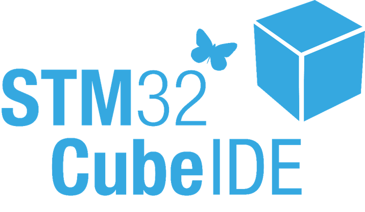
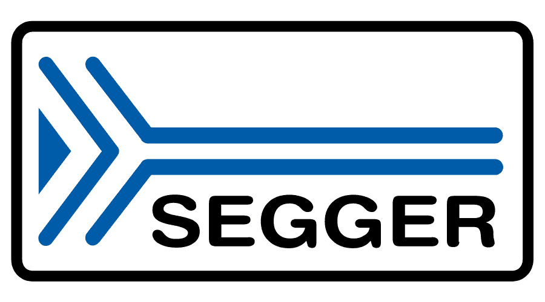

<h1 align="center">Hi 👋, I'm Irshan Nazir</h1>
<h3 align="center">Embedded Audio Systems Engineer @ Qualcomm</h3>

  

<h3 align="left">Connect with me:</h3>

<h2>🚀 What I Do</h2>

I specialize in embedded audio systems, working at the intersection of hardware and software to deliver high-performance, low-latency audio experiences.

<ul>
  <li><strong>Audio HAL Development:</strong> Building and maintaining Android Audio HAL, AudioFlinger, and Audio Policy Manager for Qualcomm platforms.</li>
  <li><strong>Bluetooth Audio:</strong> Developing and optimizing HFP, SCO, BLE-LC3, A2DP, and aptX Adaptive audio stacks.</li>
  <li><strong>Embedded Audio Systems:</strong> Implementing low-latency, real-time audio processing with power optimization on Linux, Android & RTOS.</li>
  <li><strong>Linux & Device Drivers:</strong> Writing and debugging device drivers, IPC mechanisms, and multi-threaded audio pipelines.</li>
  <li><strong>Debugging & Validation:</strong> Leveraging GDB, Logcat, and ADB for deep system-level audio debugging and validation.</li>
</ul>

---

<h2>🛠️ Skills</h2>

| Category | Technologies |
|---|---|
| **Languages** | C · C++ · Embedded C |
| **Audio Systems** | ALSA · Android Audio HAL · AudioFlinger · Audio Policy Manager · Low-latency & Real-time Audio · Power Optimization |
| **Bluetooth Audio** | HFP · SCO · BLE-LC3 · A2DP · aptX Adaptive |
| **OS & Platforms** | Linux · Android · RTOS |
| **Tools & Debug** | GDB · Logcat · ADB · Git |
| **Systems** | Multi-threading · IPC · Device Drivers |
| **Soft Skills** | Team Collaboration · Result-driven |

---

<h3 align="left">Languages and Tools:</h3>

---

<h2>🎯 Future Goals</h2>

Continuing to push the boundaries of embedded audio — from optimizing Bluetooth audio codecs to building smarter, power-efficient audio pipelines. My goal is to contribute to next-gen audio experiences on Qualcomm platforms and beyond.

Feel free to explore my repositories, and let's collaborate on something amazing! 🤝

